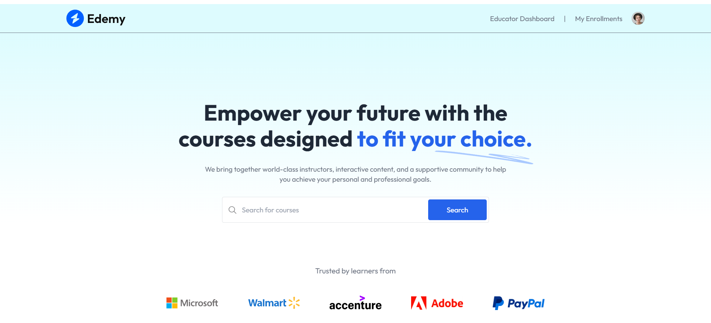
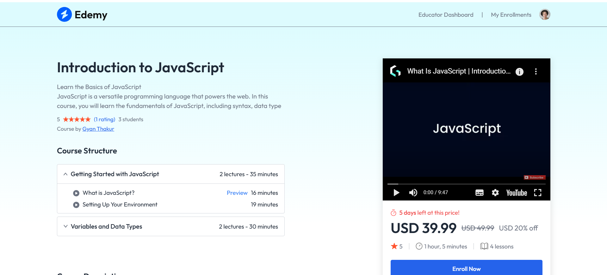
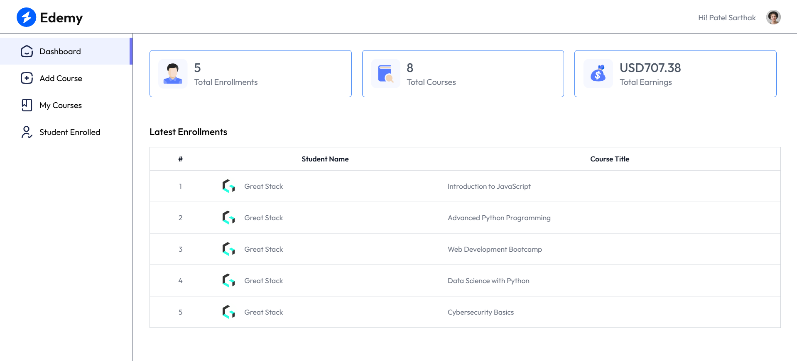
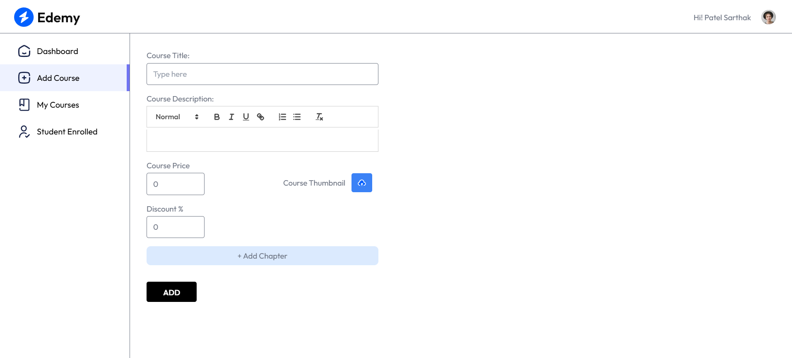
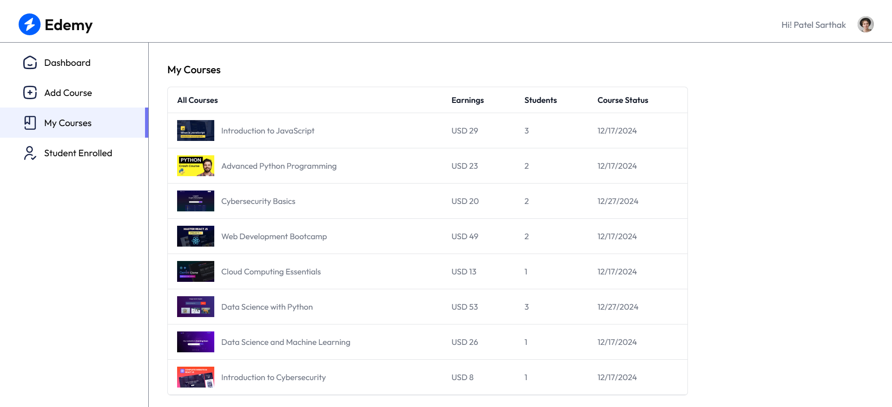
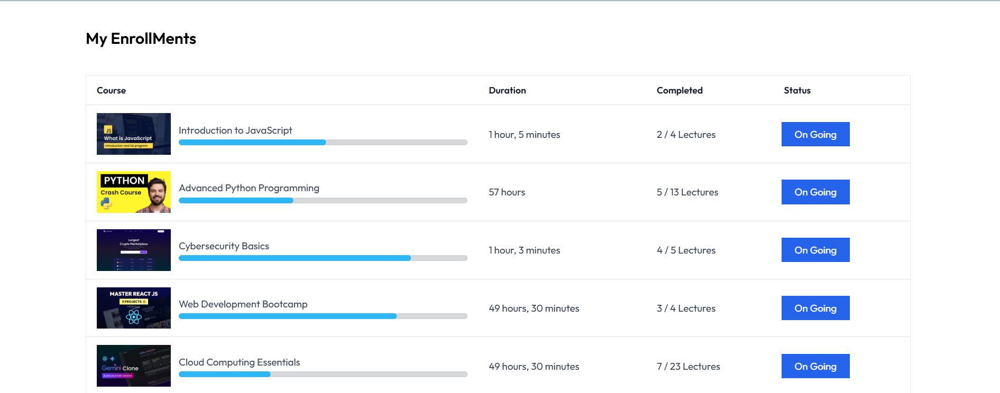
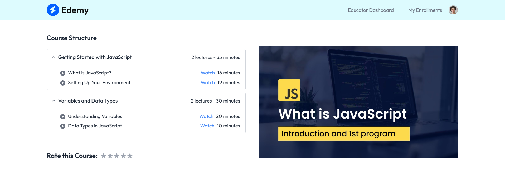
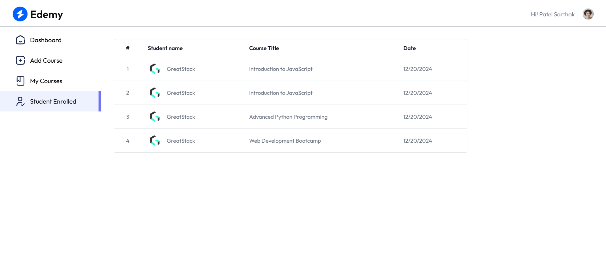

<div align="center">
  


</div>

# Edemy LMS 🎓 - A Modern Learning Management System


Edemy LMS is a full-stack learning management system (LMS) that provides educators and students with a seamless e-learning experience. Built using modern web technologies, it includes user authentication, course management, video streaming, and progress tracking.

## 🚀 Tech Stack

### Frontend:
- **React** (via Vite) ⚡
- **React Router DOM** for navigation
- **React Toastify** for notifications
- **Framer Motion** for animations
- **Quill** for rich text editing
- **Axios** for API requests
- **RC Progress** for progress tracking
- **React YouTube** for video embedding
- **Clerk Authentication** for user management

### Backend:
- **Node.js** & **Express.js** 🚀
- **MongoDB** & **Mongoose** for database
- **Cloudinary** for media storage
- **Multer** for file uploads
- **Stripe** for payment processing
- **Cors** for cross-origin requests
- **Dotenv** for environment variables
- **Nodemon** for development

---

## 📂 Project Structure

### **Frontend (`client/`)**
```
📦 client
 ├── 📂 src
 │   ├── 📂 assets
 │   ├── 📂 components
 │   │   ├── 📂 educator
 │   │   │   ├── Footer.jsx
 │   │   │   ├── Navbar.jsx
 │   │   │   ├── Sidebar.jsx
 │   │   ├── 📂 student
 │   │   │   ├── Logger.jsx
 │   ├── 📂 context
 │   │   ├── AppContext.jsx
 │   ├── 📂 pages
 │   │   ├── 📂 educator
 │   │   │   ├── AddCourse.jsx
 │   │   │   ├── Dashboard.jsx
 │   │   │   ├── Educator.jsx
 │   │   │   ├── MyCourses.jsx
 │   │   │   ├── StudentsEnrolled.jsx
 │   │   ├── 📂 student
 │   │   │   ├── CourseDetails.jsx
 │   │   │   ├── CoursesList.jsx
 │   │   │   ├── Home.jsx
 │   │   │   ├── MyEnrollMents.jsx
 │   │   │   ├── Player.jsx
 │   │   ├── App.jsx
 │   │   ├── index.css
 │   │   ├── main.jsx
 ├── 📜 .env
 ├── 📜 .gitignore
 ├── 📜 package.json
 ├── 📜 tailwind.config.js
 ├── 📜 vite.config.js

```

### **Backend (`server/`)**
```
📦 server
 ├── 📂 configs
 │   ├── cloudinary.js
 │   ├── mongodb.js
 │   ├── multer.js
 ├── 📂 controllers
 │   ├── courseController.js
 │   ├── educatorController.js
 │   ├── userController.js
 │   ├── webhooks.js
 ├── 📂 middlewares
 │   ├── authMiddleware.js
 ├── 📂 models
 │   ├── Course.js
 │   ├── CourseProgress.js
 │   ├── Purchase.js
 │   ├── User.js
 ├── 📂 routes
 │   ├── courseRoute.js
 │   ├── educatorRoutes.js
 │   ├── userRoutes.js
 ├── 📜 .env
 ├── 📜 .gitignore
 ├── 📜 package.json
 ├── 📜 server.js
 ├── 📜 vercel.json
```

---

## 🌟 Features

✅ **User Authentication** (Signup, Login, Clerk Integration)  
✅ **Course Management** (Add, Edit, Delete, Enroll)  
✅ **Video Streaming** (Embedded YouTube player)  
✅ **Progress Tracking** (Course Completion)  
✅ **Educator Dashboard** (Monitor students)  
✅ **Secure Payments** (Stripe integration)  
✅ **Responsive Design** (Mobile-friendly UI)  

---

## 📸 Screenshots

## 📸 Screenshots
| Screenshot | Description |
|------------|------------|
|  | Home Page |
|  | Course Listing |
|  | Course Details |
|  | Video Player |
|  | User Dashboard |
|  | Add Course |
|  | My Course |
|  | Course Progress |
|  | Course Structure |
|  | Students Enrolled |


## ⚡ Installation & Setup

### 1️⃣ Clone the Repository
```bash
git clone https://github.com/sArtHak03804/Edemy.git
cd Edemy
```

### 2️⃣ Install Dependencies

#### Frontend:
```bash
cd client
npm install
npm run dev
```

#### Backend:
```bash
cd server
npm install
npm start
```

### 3️⃣ Setup Environment Variables
Create a `.env` file in both `client/` and `server/` directories and add required credentials (MongoDB, Cloudinary, Clerk, Stripe, etc.).

---

## 🔥 Deployment

This project is set up for deployment on **Vercel**.

### Deploy Backend
```bash
cd server
vercel --prod
```

### Deploy Frontend
```bash
cd client
vercel --prod
```

---

## 🔐 License
This project is licensed under the [MIT License](LICENSE).

---

## 🎯 Contributors

👤 **Gyan Pratap Singh** – *Developer & Maintainer*  
📧 Contact: [patelsarthak666gmail.com](mailto:patelsarthak666@gmail.com)  
🔗 GitHub: [@sArtHak03804](https://github.com/sArtHak03804)  


## 🌐 Connect with Us

Contact Us:  📲<a href="https://wa.me/917777977918?text=Hey%20%F0%9F%91%8B%2C%20there%20got%20your%20contact%20from%20github%20 *LMS*  repo">
    
  </a>

- **Name**: Gyan Pratap Singh
- **Email**: [patelsarthak666gmail.com](mailto:patelsarthak666@gmail.com)
- **GitHub**: [Sarthak Patel](https://github.com/sArtHak03804)

---


## Thank you for checking out the **Study Notion LMS** project! Happy coding! 😊

---
## ⭐ Support
Give a ⭐ if you like this project!

---
Made with ❤️ by Gyan Pratap Singh

### ⭐ Show Some Love!

If you like this project, don't forget to leave a **⭐ Star** on GitHub! 🚀
